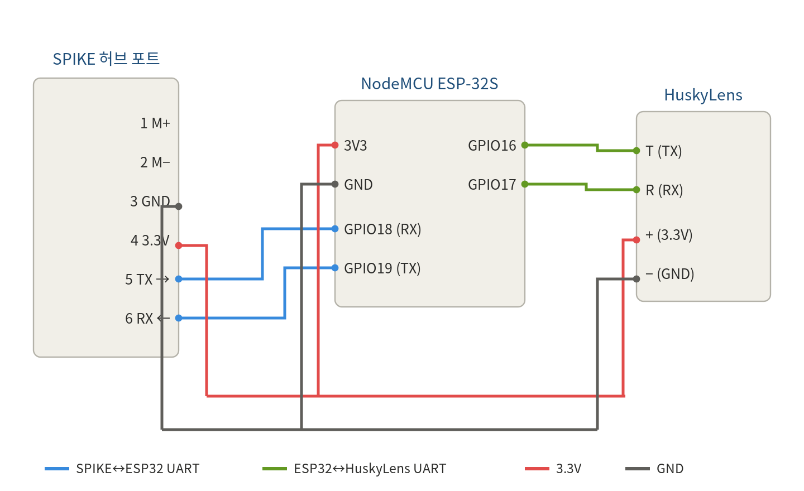
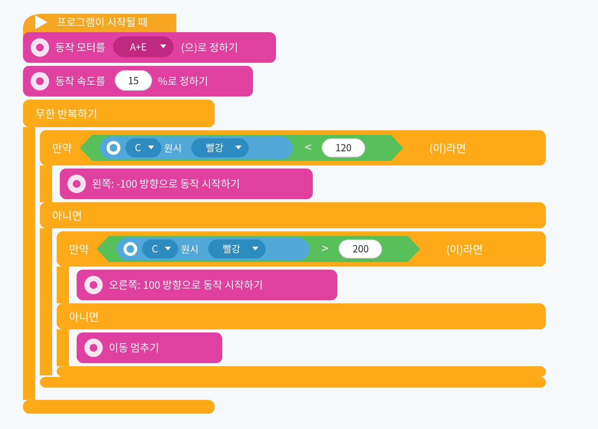

# husky_spike_esp32

**HuskyLens → ESP32 → LEGO SPIKE Prime: color tracking with SPIKE word blocks**

*[한국어 README](README.md) · English*

The ESP32 **emulates a LEGO SPIKE Color Sensor** over the LPF2 protocol. Vision data from a
HuskyLens AI camera (the detected color's ID and its X/Y position on screen) is mapped onto the
color sensor's **raw red / green / blue** values — so it can be read directly in SPIKE App 3
**word blocks**, with no extra software or plugins.

The result: a LEGO robot that sees a colored object and follows it, programmed entirely with
the Scratch-based word blocks kids already know.

| Word block | Value it carries | Range |
|---|---|---|
| **color** | Detected ID (which color) | 0 ~ |
| **raw red** | Center X (left ↔ right) | 0 ~ 320 |
| **raw green** | Center Y (up ↕ down) | 0 ~ 240 |
| **raw blue** | Width W (larger = closer) | 0 ~ |

---

## Hardware

- **NodeMCU ESP-32S** (classic ESP32 / WROOM) — has 3 UARTs, so LPF2 and the HuskyLens can run at the same time
- **HuskyLens** (DFRobot AI camera) — UART mode, Serial 9600
- **LEGO SPIKE Prime hub + SPIKE App 3**
- LPF2 breakout cable, jumper wires
- *(optional)* 3D-printed HuskyLens mount — see [`hardware/`](hardware/)

> ⚠️ The **ESP32-C3 is not suitable**: it has only one usable hardware UART, so LPF2 and the
> HuskyLens cannot both be served. Use a classic ESP32 (WROOM).

## Wiring



| Link | One side | Other side |
|---|---|---|
| SPIKE UART | Hub pin 5 (TX) / pin 6 (RX) | ESP32 **GPIO18 / GPIO19** |
| HuskyLens UART | HuskyLens T (green) / R (blue) | ESP32 **GPIO16 / GPIO17** |
| Power 3.3 V | Hub pin 4 | ESP32 3V3 + HuskyLens + |
| Ground | Hub pin 3 | ESP32 GND + HuskyLens − |

Everything is 3.3 V logic — **do not apply 5 V**. LPF2 pin numbering differs between cables, so
check GND and 3.3 V with a multimeter first. During bench testing you can power the ESP32 from USB.

## Install

1. **Flash MicroPython and upload the firmware** (ESP32 connected over USB):
   ```bash
   python3 tools/install_firmware.py
   ```
   This downloads MicroPython (ESP32_GENERIC), flashes it, and uploads the three files from
   `firmware/`. To re-upload code only (keeping MicroPython):
   ```bash
   python3 tools/install_firmware.py --skip-flash
   ```

2. **Set up the HuskyLens**: Protocol Type = **Serial 9600**, algorithm = **Color Recognition**,
   then learn the target color (it becomes ID 1).

> If you upload manually, all three files — `main.py`, `lpf2.py`, `pupremote.py` — must be on the
> board. `lpf2.py` **must be the combo-mode patched version** (see *How it works* below).

## Reading the values


Move the object left/right and **raw red (X)** changes; up/down changes **raw green (Y)**; bring it
closer and **raw blue (W)** grows.

## Tutorial: follow a colored ball

The working program — the robot turns left or right to keep the ball centered in the camera.
(Movement motors **A + E**, movement speed **15 %**, sensor on port **C**.)



- raw red (X) **< 120** → the ball is on the left → turn left (-100)
- raw red (X) **> 200** → the ball is on the right → turn right (100)
- in between (120–200) → centered → **stop moving**

Ideas to extend it: hold a distance using `raw blue` (W), react only to a specific `color` (ID), or
tilt the camera up/down with `raw green` (Y).

The same behavior as a SPIKE 3 **Python** program: [`examples/red_ball_tracker.py`](examples/red_ball_tracker.py).

## How it works (combo mode)

SPIKE 3 reads several color-sensor values in one go using **combo mode** (a `0x5C` setup packet).
This hub requests six values in the order **color, reflection, R, G, B, 4th**. The firmware
(`lpf2.py`) parses that request packet and replies with the values **in exactly that order and
size**. That is why raw red (R) = X, raw green (G) = Y and raw blue (B) = W line up correctly.

The stock `lpf2` library does not handle combo mode — it returns empty values (65535) — so the
`lpf2.py` in this repository is a patched version that adds combo handling (`0x5C` / `0x4C` plus a
dynamic response).

## Repository layout

```
firmware/
  main.py          Main firmware (read HuskyLens → serve it as color-sensor values)
  lpf2.py          LPF2 library (patched: combo-mode support)
  pupremote.py     PUPRemote library
tools/
  install_firmware.py   Flashes MicroPython and uploads the firmware
examples/
  red_ball_tracker.py   SPIKE 3 Python version of the tracker
hardware/
  huskylens_lego_mount.stl   3D-printable HuskyLens mount for LEGO Technic
docs/
  wiring.png, blocks_mapping.png, blocks_tracking.png, redball_blocks.png
  guide (DOCX), elementary-school lesson book (DOCX/PDF, Korean)
```

## 3D-printed HuskyLens mount

`hardware/huskylens_lego_mount.stl` is a bracket that holds the HuskyLens and attaches to LEGO
Technic beams, so the camera can be mounted rigidly on the robot.

Suggested print settings: PLA, 0.2 mm layer height, ~20 % infill, no supports needed for most
orientations. Print the frame so the pin holes run along the print bed for the strongest fit.

## Troubleshooting

| Symptom | What to check |
|---|---|
| No color sensor appears on the port | LPF2 wiring (pin5↔GPIO18, pin6↔GPIO19, GND), firmware uploaded |
| Sensor appears then disappears | Use the latest `main.py` (it services the hub frequently enough) |
| Raw values read 65535 | `lpf2.py` must be the combo-patched version |
| Raw values read 512 / 60416 etc. | Use the latest `lpf2.py` + `main.py` (dynamic combo response) |
| Values flicker between 0 and the real value | Latest `main.py` (debounce + no unsolicited frames) |
| Values never change | HuskyLens Serial 9600, color learned, T→GPIO16 and R→GPIO17 crossed correctly |
| Odd values persist | Restart the sensor view in the SPIKE app (clears cached readings) |

## License & credits

Released under **GPL-3.0** (see [LICENSE](LICENSE)). This project uses and builds on the following
GPL open-source work:

- [`lpf2.py`, `pupremote.py`](https://github.com/antonvh/PUPRemote) — © Anton's Mindstorms (GPL-3.0).
  The `lpf2.py` here is modified to add SPIKE 3 combo-mode support.
- The color-sensor mode structure and combo-mode behavior are based on
  [MyOwnBricks](https://github.com/ysard/MyOwnBricks) — © Ysard (GPL-3.0).
- HuskyLens: [DFRobot](https://wiki.dfrobot.com/HUSKYLENS_V1.0_SKU_SEN0305_SEN0336)
