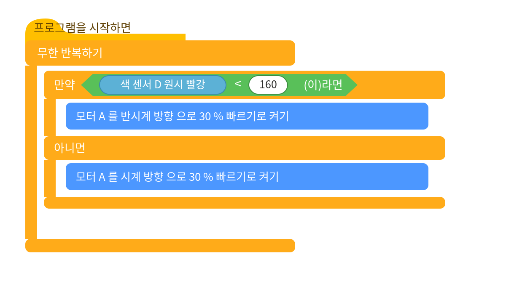

# husky_spike_esp32

**HuskyLens → ESP32 → LEGO SPIKE Prime: 색 센서로 위장해 워드 블럭에서 색상/위치 추적**

ESP32가 SPIKE 허브에게 자신을 **레고 색 센서**로 위장합니다. HuskyLens(AI 카메라)가
인식한 색·물체의 위치를 색 센서의 **원시 빨강/초록/파랑** 값에 실어 보내면, SPIKE App 3의
스크래치 기반 **워드 블럭에서 추가 설치 없이** 그 값을 읽어 색상 추적 로봇을 만들 수 있습니다.

> ESP32 emulates a LEGO SPIKE Color Sensor over the LPF2 protocol. HuskyLens vision data
> (detected color ID and its X/Y position) is mapped onto the color sensor's raw RGB values,
> so it can be read directly with SPIKE App 3 **word blocks** — no extra software.

| 워드 블럭 | 담기는 값 | 범위 |
|---|---|---|
| **색상 (color)** | 감지된 ID (어떤 색) | 0 ~ |
| **원시 빨강 (raw red)** | 중심 X (좌우) | 0 ~ 320 |
| **원시 초록 (raw green)** | 중심 Y (위아래) | 0 ~ 240 |
| **원시 파랑 (raw blue)** | 가로 W (클수록 가까움) | 0 ~ |

---

## 하드웨어

- **NodeMCU ESP-32S** (일반 ESP32 / WROOM) — UART 3개라 LPF2 + HuskyLens 동시 사용 가능
- **HuskyLens** (DFRobot AI 카메라) — UART(Serial 9600) 모드
- **LEGO SPIKE Prime 허브 + App 3**
- LPF2 브레이크아웃 케이블, 점퍼선

> ⚠️ ESP32-C3는 쓸 수 있는 하드웨어 UART가 1개뿐이라 LPF2 + HuskyLens 동시 사용이 어렵습니다.
> 일반 ESP32(WROOM)를 권장합니다.

## 배선


| 연결 | 한쪽 | 다른 쪽 |
|---|---|---|
| SPIKE UART | 허브 핀5(TX) / 핀6(RX) | ESP32 **GPIO18 / GPIO19** |
| HuskyLens UART | 허스키 T(초록) / R(파랑) | ESP32 **GPIO16 / GPIO17** |
| 전원 3.3V | 허브 핀4 | ESP32 3V3 + 허스키 + |
| 접지 GND | 허브 핀3 | ESP32 GND + 허스키 − |

모든 신호·전원은 3.3V입니다(5V 금지). LPF2 핀 번호는 케이블마다 표기가 다르니 멀티미터로
GND·3.3V를 먼저 확인하세요. 테스트 중에는 ESP32를 USB로 전원 공급해도 됩니다.

## 설치

1. **MicroPython + 펌웨어 한 번에 설치** (ESP32를 USB로 연결):
   ```bash
   python3 tools/install_firmware.py
   ```
   ESP32_GENERIC MicroPython을 굽고 `firmware/`의 세 파일을 올립니다.
   코드만 다시 올릴 때: `python3 tools/install_firmware.py --skip-flash`

2. **HuskyLens 설정**: Protocol Type = **Serial 9600**, 알고리즘 = **Color Recognition**,
   추적할 색을 학습(ID 1).

> 직접 올릴 경우, `firmware/`의 `main.py`, `lpf2.py`, `pupremote.py` 세 파일을 모두 보드에
> 올려야 합니다. 특히 `lpf2.py`는 **콤보 모드 패치본**이어야 합니다(아래 동작 원리 참고).

## 워드 블럭 값


물체를 좌우로 움직이면 **원시 빨강(X)**, 위아래로 움직이면 **원시 초록(Y)**, 가까워지면
**원시 파랑(W)** 이 변합니다.

## 워드 블럭 튜토리얼: 색상 따라가기

학습한 색을 화면 중앙에 두도록 모터(포트 A)를 좌우로 돌리는 기본 추적 프로그램입니다.



- 원시 빨강(X)이 중앙(160)보다 작으면 색이 왼쪽 → 왼쪽으로 회전
- 크면 오른쪽 → 오른쪽으로 회전
- 발전: `색상=0`(감지 없음)이면 정지, `원시 파랑(W)`로 거리 유지, `색상(ID)`로 특정 색만 반응

자세한 단계별 튜토리얼과 그림은 [`docs/허스키렌즈_SPIKE_최종가이드.docx`](docs/)를 참고하세요.

## 동작 원리 (콤보 모드)

SPIKE3는 색 센서의 여러 값을 한 번에 읽기 위해 **콤보 모드**를 설정합니다(`0x5C` 패킷).
이 허브는 **색상·반사광·R·G·B·4번째** 순서로 6개 값을 요청합니다. 펌웨어(`lpf2.py`)는 이
요청 패킷을 파싱해 **같은 순서·크기**로 데이터를 채워 응답합니다. 그래서 원시 빨강(R)=X,
원시 초록(G)=Y, 원시 파랑(B)=W 로 정확히 매핑됩니다.

일반 `lpf2` 라이브러리는 콤보 모드를 처리하지 않아 빈 값(65535)이 나오므로, 이 저장소의
`lpf2.py`는 콤보 처리(`0x5C`/`0x4C` + 동적 응답)를 추가한 패치본을 사용합니다.

## 파일 구성

```
firmware/
  main.py          메인 펌웨어 (HuskyLens 읽기 → 색 센서 값으로 전달)
  lpf2.py          LPF2 라이브러리 (콤보 모드 패치본)
  pupremote.py     PUPRemote 라이브러리
tools/
  install_firmware.py   MicroPython + 펌웨어 자동 설치 스크립트
docs/
  wiring.png, blocks_mapping.png, blocks_tracking.png
  허스키렌즈_SPIKE_최종가이드.docx
```

## 트러블슈팅

| 증상 | 조치 |
|---|---|
| 포트에 색 센서 안 잡힘 | LPF2 배선(핀5↔GPIO18, 핀6↔GPIO19, GND), 펌웨어 업로드 확인 |
| 센서가 떴다 사라짐 | 연결 끊김 방지(p.process 자주 호출)된 최신 main.py |
| 원시값이 65535 | `lpf2.py`가 콤보 패치본인지 확인 |
| 원시값이 512/60416 등 | 콤보 동적 응답 최신 lpf2/main 사용 |
| 0과 실제값 깜빡임 | 디바운스 + 비요청 전송 금지된 최신 main.py |
| 값이 안 변함 | 허스키 Serial 9600 / 색 학습, T→GPIO16·R→GPIO17 교차 확인 |
| 이상값 지속 | SPIKE 앱 센서 화면 재시작(캐시 방지) |

## 라이선스 / 크레딧

이 프로젝트는 **GPL-3.0**으로 배포됩니다([LICENSE](LICENSE)). 다음 GPL 오픈소스를 사용/참고했습니다:

- [`lpf2.py`, `pupremote.py`](https://github.com/antonvh/PUPRemote) — © Anton's Mindstorms (GPL-3.0).
  본 저장소의 `lpf2.py`는 SPIKE3 콤보 모드 지원을 추가한 수정본입니다.
- 색 센서 모드 구조/콤보 동작은 [MyOwnBricks](https://github.com/ysard/MyOwnBricks)
  (© Ysard, GPL-3.0)의 `ColorSensor` 구현을 참고했습니다.
- HuskyLens: [DFRobot](https://wiki.dfrobot.com/HUSKYLENS_V1.0_SKU_SEN0305_SEN0336)
