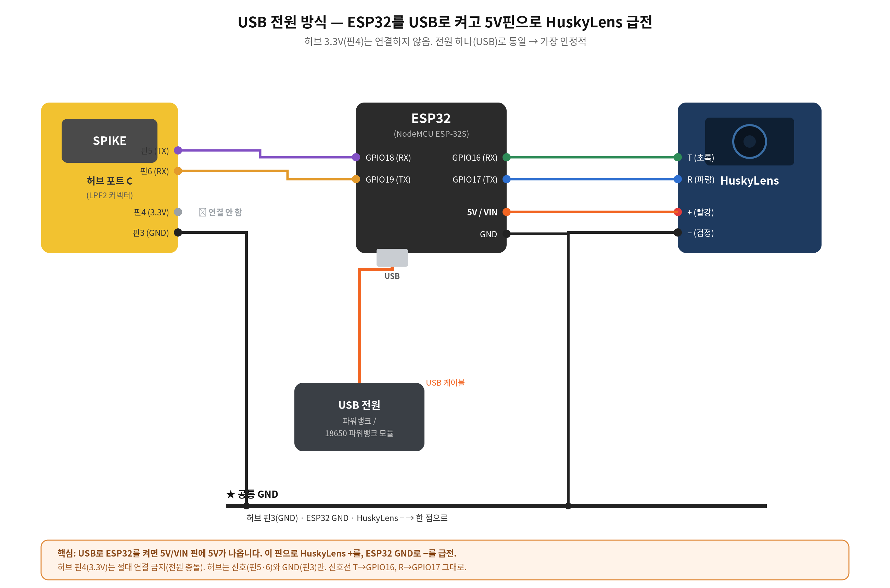
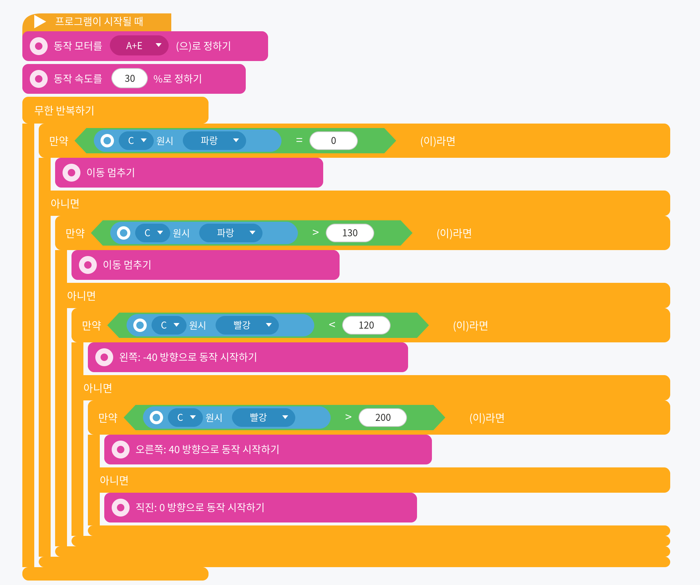
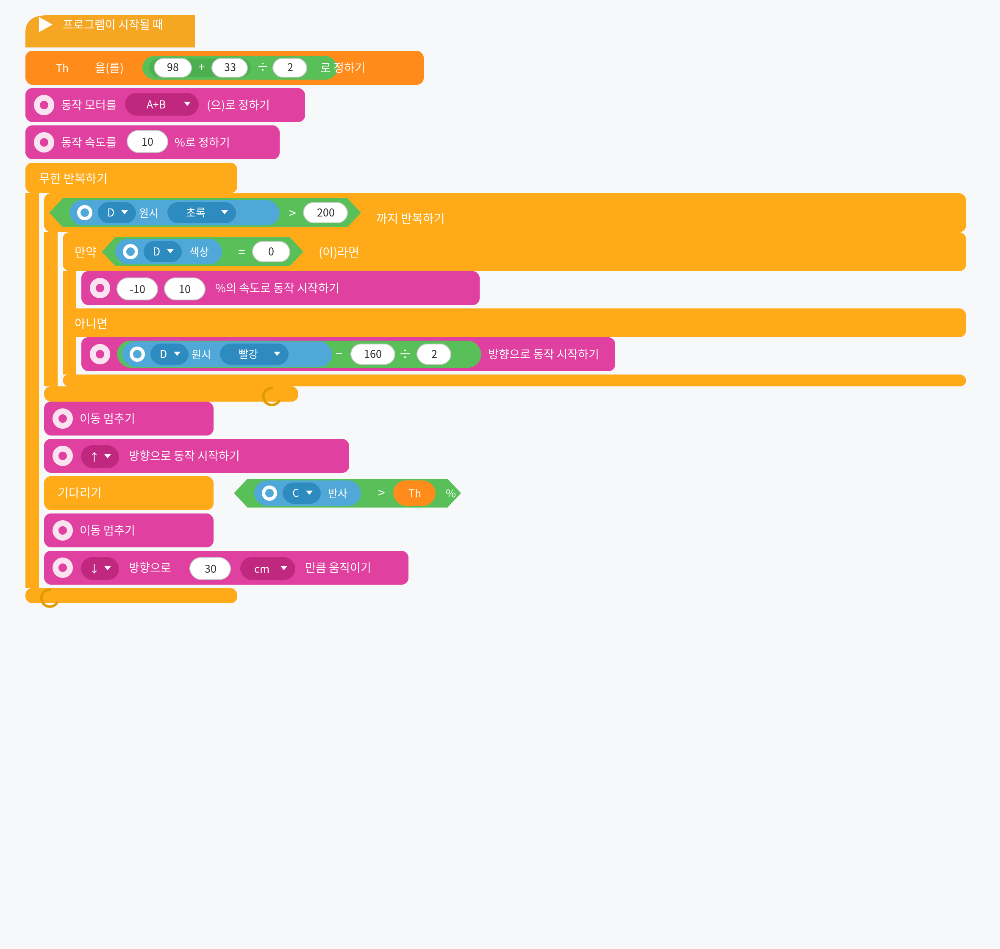
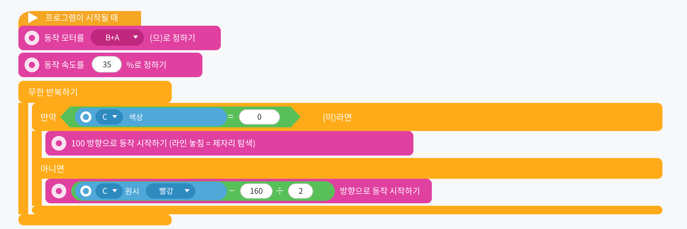

# husky_spike_esp32

**HuskyLens → ESP32 → LEGO SPIKE Prime: 색 센서로 위장해 워드 블럭에서 색상/위치 추적**

*한국어 · [English README](README.en.md)*

ESP32가 SPIKE 허브에게 자신을 **레고 색 센서**로 위장합니다. HuskyLens(AI 카메라)가
인식한 색·물체의 위치를 색 센서의 **원시 빨강/초록/파랑** 값에 실어 보내면, SPIKE App 3의
스크래치 기반 **워드 블럭에서 추가 설치 없이** 그 값을 읽어 색상 추적 로봇을 만들 수 있습니다.

> ESP32 emulates a LEGO SPIKE Color Sensor over the LPF2 protocol. HuskyLens vision data
> (detected color ID and its X/Y position) is mapped onto the color sensor's raw RGB values,
> so it can be read directly with SPIKE App 3 **word blocks** — no extra software.

허스키렌즈의 **모든 알고리즘**을 지원하며, 펌웨어가 데이터 종류를 자동으로 구분합니다.

**① 블록형** — 색상 인식 · 물체 인식 · 물체 추적 · 얼굴 인식 · 태그 인식 · 물체 분류

| 워드 블럭 | 담기는 값 | 범위 |
|---|---|---|
| **색상 (color)** | 감지된 ID | 0 ~ |
| **원시 빨강 (raw red)** | 중심 X (좌우) | 0 ~ 320 |
| **원시 초록 (raw green)** | 중심 Y (위아래) | 0 ~ 240 |
| **원시 파랑 (raw blue)** | 가로 W (클수록 가까움) | 0 ~ |

**② 화살표형** — 라인 추적(Line Tracking)

| 워드 블럭 | 담기는 값 | 범위 |
|---|---|---|
| **색상 (color)** | 1 = 라인 감지, 0 = 없음 | 0 / 1 |
| **원시 빨강 (raw red)** | 화살표 시작 X (로봇 바로 앞) | 0 ~ 320 |
| **원시 초록 (raw green)** | 화살표 끝 X (앞쪽 방향) | 0 ~ 320 |
| **원시 파랑 (raw blue)** | 화살표 끝 Y | 0 ~ 240 |

ESP32는 설정할 것이 없습니다. **허스키렌즈에서 알고리즘만 바꾸면** 값의 의미가 바로 바뀌고,
SPIKE 프로그램만 모드에 맞는 것을 쓰면 됩니다.

---

## 하드웨어

- **NodeMCU ESP-32S** (일반 ESP32 / WROOM) — UART 3개라 LPF2 + HuskyLens 동시 사용 가능
- **HuskyLens** (DFRobot AI 카메라) — UART(Serial 9600) 모드
- **LEGO SPIKE Prime 허브 + App 3**
- LPF2 브레이크아웃 케이블, 점퍼선

> ⚠️ ESP32-C3는 쓸 수 있는 하드웨어 UART가 1개뿐이라 LPF2 + HuskyLens 동시 사용이 어렵습니다.
> 일반 ESP32(WROOM)를 권장합니다.

## 배선

신호선은 어느 방식이든 동일합니다. **차이는 전원을 어디서 주느냐**입니다(아래 "전원 공급" 참고).

| 연결 | 한쪽 | 다른 쪽 |
|---|---|---|
| SPIKE UART | 허브 핀5(TX) / 핀6(RX) | ESP32 **GPIO18 / GPIO19** |
| HuskyLens UART | 허스키 T(초록) / R(파랑) | ESP32 **GPIO16 / GPIO17** |
| 접지 GND (공통) | 허브 핀3 | ESP32 GND + 허스키 − |

신호선의 T/R는 반드시 **교차**(허스키 T→GPIO16, R→GPIO17)합니다. LPF2 핀 번호는 케이블마다
표기가 다르니 멀티미터로 GND·전원을 먼저 확인하세요.

## 전원 공급 (중요)

**권장: USB로 ESP32를 켜고, 5V핀으로 HuskyLens 급전.**



HuskyLens는 3.3V에서 약 320mA 이상을 소모합니다. 허브 핀4(3.3V)로 카메라까지 함께 먹이면
전류가 빠듯해 **고주파 코일 울음·전압 강하·리부팅**이 생길 수 있습니다(허브 3.3V만으로도 켜지긴
하지만 마진이 거의 없습니다). 그래서 카메라 전원은 허브에서 분리하는 것을 권장합니다.

| 방식 | 요약 | 비고 |
|---|---|---|
| ⭐ **USB 급전** | USB(파워뱅크)로 ESP32 → **5V/VIN 핀**으로 허스키 +, ESP32 GND로 − | 부품 최소·가장 안정. **허브 핀4(3.3V) 연결 금지**([docs/usb_power.png](docs/usb_power.png)) |
| 배터리 (18650 1셀) | **DFR0968** 같은 승압·보호 내장 파워뱅크 보드의 USB 5V 출력 → ESP32 USB | 로봇 탑재용으로 가장 간단 ([docs/dfr0968_power.png](docs/dfr0968_power.png)) |
| 배터리 (18650 2S) | 18650 ×2 직렬(7.4V) + **2S BMS** → **LM2596로 5V 강압** → ESP32 5V/VIN | LM2596 있을 때 ([docs/bat18650_power.png](docs/bat18650_power.png)) |
| 별도 5V 전원 | 허스키만 독립 5V, **GND만 공통** | [docs/sep_power.png](docs/sep_power.png) |
| 허브 3.3V 공유 + 커패시터 | 허브 3.3V 유지 + 허스키 전원핀에 **470~1000µF** 병렬 | 임시 완화책 ([docs/cap_diagram.png](docs/cap_diagram.png), [docs/full_wiring_cap.png](docs/full_wiring_cap.png)) |

어느 방식이든 **모든 GND는 한 점으로 공통 접지**해야 UART 통신이 됩니다. 신호는 3.3V 로직입니다.
18650 단전지는 직결하지 말고 **5V 승압·보호가 되는 보드/모듈**을 거치세요(DFR0968은 승압·과충전·
과방전 보호가 내장이라 1셀로 바로 됩니다). 펌웨어는 전원 방식과 무관하게 그대로입니다.

## 설치

1. **MicroPython + 펌웨어 한 번에 설치** (ESP32를 USB로 연결):
   ```bash
   python3 tools/install_firmware.py
   ```
   ESP32_GENERIC MicroPython을 굽고 `firmware/`의 세 파일을 올립니다.
   코드만 다시 올릴 때: `python3 tools/install_firmware.py --skip-flash`

2. **HuskyLens 설정**: Protocol Type = **Serial 9600**, 알고리즘 = **Color Recognition**,
   추적할 색을 학습(ID 1).

> 직접 올릴 경우, `firmware/`의 `main.py`, `lpf2.py`, `pupremote.py` 세 파일을 모두 보드에
> 올려야 합니다. 특히 `lpf2.py`는 **콤보 모드 패치본**이어야 합니다(아래 동작 원리 참고).

## 워드 블럭 값


물체를 좌우로 움직이면 **원시 빨강(X)**, 위아래로 움직이면 **원시 초록(Y)**, 가까워지면
**원시 파랑(W)** 이 변합니다.

## 워드 블럭 튜토리얼: 색상 따라가기

학습한 색이 화면 **중앙에 오도록** 로봇이 좌우로 회전하는 실제 동작 프로그램입니다.
(구동 모터 **A+E**, 동작 속도 **15 %**, 센서는 포트 **C**)


- **원시 빨강(X) ＜ 120** → 물체가 왼쪽 → 왼쪽(-100)으로 회전
- **원시 빨강(X) ＞ 200** → 물체가 오른쪽 → 오른쪽(100)으로 회전
- 그 사이(120~200) → 중앙 → **이동 멈추기**

발전 아이디어: `원시 파랑(W)`으로 거리 유지(가까우면 후진), `색상(ID)`으로 특정 색만 반응,
`원시 초록(Y)`으로 카메라를 위아래로 기울이기.

같은 동작의 **파이썬 버전**은 [`examples/red_ball_tracker.py`](examples/red_ball_tracker.py)에 있습니다.

**한 걸음 더 — 따라가기(전진/후진 포함).** 좌우 조향에 더해 거리(원시 파랑 W)까지 맞춰
물체를 쫓아가는 예제입니다. 워드 블럭 [`docs/follow_blocks.png`](docs/follow_blocks.png),
파이썬 [`examples/object_follower.py`](examples/object_follower.py).



**탐색 + 추적 + 정지.** 물체가 안 보이면 제자리에서 찾고, 너무 가까우면 멈추는 3단 판단
예제입니다. [`docs/smart_tracker_blocks.png`](docs/smart_tracker_blocks.png) /
[`examples/smart_color_tracker.py`](examples/smart_color_tracker.py).

**탐색 → 근접 → 바닥감지 후진 (응용 예제).** 물체를 찾아 추적하다 가까워지면(원시 초록 Y > 200)
직진하고, 포트 **C의 실제 컬러센서**가 임계값보다 밝아지면 뒤로 30cm 물러납니다. 임계값
`Th = (밝은값 + 어두운값) ÷ 2` 로 자동 보정합니다.
[`docs/search_blocks.png`](docs/search_blocks.png) / [`examples/search_track_reverse.py`](examples/search_track_reverse.py).



> 이 예제는 **센서 두 개**를 씁니다: 비전용(ESP32, 포트 D)과 밝기용(실제 컬러센서, 포트 C).

## 라인 트레이싱

허스키렌즈 알고리즘을 **Line Tracking** 으로 바꾸고 라인을 학습시키면, 같은 펌웨어로
라인 추적 로봇이 됩니다. 조향은 **원시 빨강(지금 라인 위치, 중앙 160)** 으로 합니다.



파이썬 버전 [`examples/line_follower.py`](examples/line_follower.py) 은 여기에
**원시 초록 − 원시 빨강**(앞쪽에서 라인이 휘는 방향)까지 더해 커브에서 더 부드럽게 돕니다.

> 조향이 반대면 모터 좌우를 바꾸고, 지그재그로 흔들리면 나눗수를 키우세요(`÷2` → `÷3`).
> 센서 블럭의 **포트는 ESP32가 꽂힌 포트로 통일**해야 합니다(모터 포트와 겹치지 않게).

자세한 단계별 튜토리얼과 그림은 [`docs/허스키렌즈_SPIKE_최종가이드.docx`](docs/)를 참고하세요.

## 동작 원리 (콤보 모드)

SPIKE3는 색 센서의 여러 값을 한 번에 읽기 위해 **콤보 모드**를 설정합니다(`0x5C` 패킷).
이 허브는 **색상·반사광·R·G·B·4번째** 순서로 6개 값을 요청합니다. 펌웨어(`lpf2.py`)는 이
요청 패킷을 파싱해 **같은 순서·크기**로 데이터를 채워 응답합니다. 그래서 원시 빨강(R)=X,
원시 초록(G)=Y, 원시 파랑(B)=W 로 정확히 매핑됩니다.

일반 `lpf2` 라이브러리는 콤보 모드를 처리하지 않아 빈 값(65535)이 나오므로, 이 저장소의
`lpf2.py`는 콤보 처리(`0x5C`/`0x4C` + 동적 응답)를 추가한 패치본을 사용합니다.

## 3D 프린트 허스키렌즈 마운트

`hardware/huskylens_lego_mount.stl` 은 허스키렌즈를 잡아 **레고 테크닉 빔에 고정**하는 브래킷입니다.
카메라를 로봇에 단단히 달 수 있습니다.

권장 출력 설정: PLA, 레이어 0.2mm, 채움 ~20%, 대부분 방향에서 서포트 불필요.
핀 구멍이 베드와 나란하도록 눕혀 출력하면 결합이 가장 튼튼합니다.

## 파일 구성

```
firmware/
  main.py          메인 펌웨어 (HuskyLens 읽기 → 색 센서 값으로 전달)
  lpf2.py          LPF2 라이브러리 (콤보 모드 패치본)
  pupremote.py     PUPRemote 라이브러리
tools/
  install_firmware.py   MicroPython + 펌웨어 자동 설치 스크립트
examples/
  red_ball_tracker.py     SPIKE 3 파이썬 추적 코드 (좌우 조향)
  object_follower.py      따라가기 (조향 + 전진/후진)
  color_tracker.py        탐지한 색상 추적 (비례 조향)
  smart_color_tracker.py  탐색 + 추적 + 정지 (3단 판단)
  search_track_reverse.py 탐색→근접→바닥감지 후진 (센서 2개)
  line_follower.py        라인 트레이싱 (Line Tracking 모드)
hardware/
  huskylens_lego_mount.stl   3D 프린트용 허스키렌즈 레고 마운트
docs/
  usb_power.png         ⭐ 권장 전원 배선 (USB 급전)
  sep_power.png, cap_diagram.png, full_wiring_cap.png   전원 옵션 배선
  redball_blocks.png, follow_blocks.png   워드 블럭 예제
  blocks_mapping.png, blocks_tracking.png, wiring.png
  허스키렌즈_SPIKE_최종가이드.docx
  초등_AI로봇_학습참고서.docx / .pdf   (초등학생용 학습 참고서)
```

## 트러블슈팅

| 증상 | 조치 |
|---|---|
| 포트에 색 센서 안 잡힘 | LPF2 배선(핀5↔GPIO18, 핀6↔GPIO19, GND), 펌웨어 업로드 확인 |
| 센서가 떴다 사라짐 | 연결 끊김 방지(p.process 자주 호출)된 최신 main.py |
| 원시값이 65535 | `lpf2.py`가 콤보 패치본인지 확인 |
| 원시값이 512/60416 등 | 콤보 동적 응답 최신 lpf2/main 사용 |
| 0과 실제값 깜빡임 | 디바운스 + 비요청 전송 금지된 최신 main.py |
| 값이 안 변함 | 허스키 Serial 9600 / 색 학습, T→GPIO16·R→GPIO17 교차 확인 |
| 이상값 지속 | SPIKE 앱 센서 화면 재시작(캐시 방지) |

## 관련 연구 / 이 프로젝트가 다른 점

비슷한 시도가 이미 있습니다. 무엇이 다른지 정리합니다.

| 프로젝트 | 방식 | 워드 블럭 | 보드 |
|---|---|---|---|
| [Anton's Mindstorms — HuskyLens with Block Code](https://www.antonsmindstorms.com/2025/07/26/huskylens-spike-prime-blocks/) (2025) | 색 센서 위장 + MicroBlocks | ✅ | 전용 **LMS-ESP32** |
| [Anton's Mindstorms — Pybricks + HuskyLens](https://www.antonsmindstorms.com/2024/11/24/pybricks-huskylens-a-simple-spike-prime-camera-line-follower/) | Pybricks 파이썬 | ❌ | LMS-ESP32 |
| [ysard/MyOwnBricks](https://github.com/ysard/MyOwnBricks) | 아두이노 색 센서 에뮬레이션 라이브러리 | (허브 연결 예제 없음) | AVR/아두이노 |
| [DanieleBenedettelli/HuskyLensSPIKE](https://github.com/DanieleBenedettelli/HuskyLensSPIKE) | 허브 MicroPython 라이브러리 | ❌ | 보드 불필요 |
| **이 저장소** | 색 센서 위장 + **MicroPython** | ✅ | **범용 NodeMCU ESP-32S** |

이 저장소의 특징:

- **전용 보드가 필요 없습니다.** 흔한 NodeMCU ESP-32S(WROOM) 한 장이면 됩니다.
- **MicroPython + 콤보 모드 패치.** SPIKE App 3가 색 센서 값을 읽을 때 쓰는 콤보 모드(`0x5C`) 요청을
  직접 파싱해 같은 순서·크기로 응답합니다. 공개된 `lpf2.py`(antonvh/PUPRemote)는 콤보를 처리하지 않아
  워드 블럭에서 65535가 나옵니다 — 이 패치가 핵심 기여입니다.
- HuskyLens의 **ID / 중심 X / 중심 Y / 가로폭 W** 를 색상·원시 빨강·초록·파랑에 매핑하는 규칙을 문서화했습니다.
- 3D 프린트 마운트 STL, 자동 설치 스크립트, 초등학생용 학습 참고서를 함께 제공합니다.

## 라이선스 / 크레딧

이 프로젝트는 **GPL-3.0**으로 배포됩니다([LICENSE](LICENSE)). 다음 GPL 오픈소스를 사용/참고했습니다:

- [`lpf2.py`, `pupremote.py`](https://github.com/antonvh/PUPRemote) — © Anton's Mindstorms (GPL-3.0).
  본 저장소의 `lpf2.py`는 SPIKE3 콤보 모드 지원을 추가한 수정본입니다.
- 색 센서 모드 구조/콤보 동작은 [MyOwnBricks](https://github.com/ysard/MyOwnBricks)
  (© Ysard, GPL-3.0)의 `ColorSensor` 구현을 참고했습니다.
- HuskyLens: [DFRobot](https://wiki.dfrobot.com/HUSKYLENS_V1.0_SKU_SEN0305_SEN0336)
